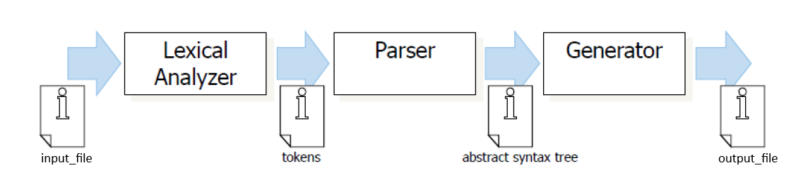

# A toy compiler
Compiler design and implementation project for a toy language (with specifications provided) for the course CS F363 (Compiler Construction), Spring '24, BITS Pilani.
## Architecture
This uses the Pipe and Filter architecture as usually implemented in compilers. The input is a stream of data which flows from one component to another directly via a "pipe" (which has a single source of input and output), and is processed at different stages by various "filters" (independent components). Each component performs only one function, which establishes a loosely coupled system.

## Credits
- [Aditya Thakur](https://github.com/cry0genic)
- [Amal Sayeed](https://github.com/amal-sayeed)
- [Ohiduz Zaman](https://github.com/Ohiduz)
- [Priyansh Patel](https://github.com/PriyanshPatelBits)
- [Rachoita Das](https://github.com/Rachoita-Das)
- [Subhramit Basu](https://github.com/subhramit)

## License
This piece of software is licensed under an [MIT License](https://opensource.org/licenses/MIT).  For more details, refer to the LICENSE file.
